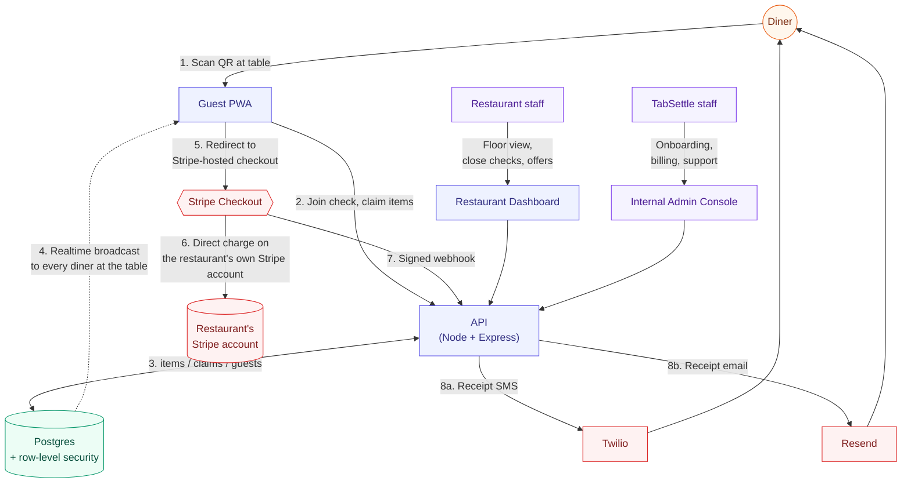

# TabSettle

> QR pay-at-table payments for full-service restaurants. Scan, split, tip, pay, from your own phone.

## Problem

At a sit-down restaurant, splitting a bill across a group means flagging a server, waiting for a card machine, and doing math out loud at the table. Nobody pays until the whole group is ready, and the server is stuck holding one check for four or five different cards. TabSettle lets every diner at the table settle their own share the moment they're done eating, without waiting on anyone else.

## Solution

A guest scans a QR code at the table, views an itemized check, and claims what they ordered by selecting the full item, splitting it evenly with others, or entering a custom amount. They can then add a tip and pay through a Stripe-hosted checkout page, all from their own phone with no app required. Claims and payments update live for everyone at the table. The system turns a static printed check into a shared, interactive experience where guests can claim, split, and pay for items in real time, similar to collaborating in a Google Doc.

Three apps share one Postgres database and one Node API:

| App | Audience | Stack |
|---|---|---|
| Guest PWA | Diners | React 18 + Vite, service worker, installable |
| Restaurant Dashboard | Owners, managers, servers | React 18 + Vite, floor view, redemption feed |
| Internal Admin Console | TabSettle staff | React 18 + Vite, Supabase Auth + TOTP 2FA |
| API | All three frontends + Stripe webhooks | Node + Express + TypeScript |

**Status: live in pilot.** The core check/claim/pay flow, an opt-in promotional offer engine, and a self-serve demo sandbox are all shipped and running. A second wave of unclaimed-balance recovery (automated SMS recall for shortfalls left on a check) is spec'd and waiting on UX signoff before it writes anything.

## Architecture

The card path never touches TabSettle's own systems. The PWA redirects to a Stripe-hosted checkout page; the API only ever sees Stripe IDs and amounts back. That keeps TabSettle at the simplest PCI posture (SAQ-A). Payments are Stripe Connect direct charges, so the diner's card is charged on the restaurant's own connected Stripe account, not TabSettle's platform account. TabSettle revenue is a separate monthly subscription invoice, fully independent of the diner-facing charge.

## Stack & Key Decisions

| Decision | Choice | Why |
|---|---|---|
| Guest experience | PWA, not a native app | Diners are one-time or infrequent visitors to any given restaurant. An install wall would kill conversion at the exact moment someone wants to pay and leave. A QR scan works instantly on any phone. |
| Payments | Stripe Connect direct charges (not destination charges) | The original design took a small platform fee from the top of a destination charge, which meant Stripe's own processing fee came out of TabSettle's revenue. Direct charges put the processing fee on the restaurant's account like any other card transaction, and TabSettle bills separately as a SaaS subscription. |
| Promotional vs. transactional messaging | Fully separate Twilio sending numbers, separate email senders, and separate consent flags for offers/marketing vs. receipts/recovery | TCPA and CAN-SPAM treat the two categories differently, and routing marketing traffic through the transactional sender risks the number's deliverability for receipts and OTP codes. Splitting them is a compliance boundary, not an implementation detail. |
| Tenant data access | Row-level security lockdown on `restaurants` / `tables` / `menu_items` | A security pass found these tables had blanket "true" read policies left over from early development, readable by anyone holding the public anon key. Replaced with membership-scoped policies so a diner's anonymous session can only ever see the restaurant and table it actually joined. |
| Self-serve demo | A `demo_mode` flag, default off, scoped to one demo restaurant | Prospective restaurant owners can try a real, fully-wired check (real claims, real split math, real receipts) without a sales call, but the flag guarantees production behavior for real accounts can never be affected by the demo path. Only the Stripe charge is faked. |

## Screenshots

Screenshots coming: the guest PWA check view, the restaurant dashboard floor view, and the admin console restaurant detail page.

<!--
Wanted for a future pass, from a real device or a machine with screen-recording enabled:
- Guest PWA: check view showing itemized bill with claimed-item avatars, and the payment tray with tip selector
- Restaurant Dashboard: floor view with table status, and the offer redemption feed
- Internal Admin Console: restaurant detail page, offers add-on entitlement toggle
-->

## Incidents & fixes

**Tenant data exposed through open RLS policies.** A security review found that `restaurants`, `tables`, and `menu_items` all had `USING (true)` row-level-security policies left over from early development, meaning anyone with the public anon key could read every restaurant's row directly, including fields like the Stripe account ID and owner email that were never meant to be public. Fix was to scope all three tables to restaurant membership through a `SECURITY DEFINER` helper function. The first attempt at that fix caused a same-day regression: an inline subquery against the membership table triggered infinite recursion in Postgres's own RLS evaluation, which broke the restaurant dashboard's table list. The recursion was fixed by moving the membership lookup into a security-definer function that bypasses RLS on that one table by design, the same pattern already used elsewhere in the schema.

**A whitelist that was too aggressive.** Locking down the tenant-data leak above meant introducing a whitelist for what the API returns to the guest PWA for restaurant and table data. The first version of that whitelist dropped a feature flag the post-payment screen depended on, silently hiding the loyalty opt-in for every restaurant that had it enabled. Caught via the demo restaurant, fixed by adding the flag back to the whitelist. The lesson that stuck: when narrowing an API response a frontend already depends on, grep the frontend for every field it reads before shipping the narrower shape.

**A promotional channel that delivered nothing.** After building the opt-in flow for the promotional offer engine, an audit turned up the send function for a diner's welcome offer had no caller anywhere in the codebase. Opting in correctly recorded consent and queued the message, but nothing ever triggered the actual send. Fixed by wiring the opt-in endpoint to enqueue and attempt an inline send in the same request, with the queued row surviving as a retry candidate if the provider call fails.

**A welcome offer that could be claimed more than once.** The one-time signup discount was designed to be issued once per diner per restaurant, but the guard in place only blocked a second offer while an earlier one was still active, not once it had already been redeemed. That let the same diner opt in again after redeeming and receive the discount repeatedly. Fixed by widening the check to any prior issuance in any state, scoped specifically to the welcome-offer type so it doesn't interfere with future one-off promotional campaigns.

## Outcomes

- Live in pilot: three separate frontends, one shared API, one Postgres database, all on Railway and Supabase.
- Payments run through Stripe Connect direct charges; TabSettle never stores or transmits card data (SAQ-A PCI scope).
- Promotional offer engine shipped end to end across six build sprints: diner accounts, phone-OTP sign-in, opt-in consent capture, automatic welcome-offer issuance and redemption at checkout, manual code-entry redemption, and a live restaurant-side redemption feed.
- A security review closed two separate tenant-data exposure paths (open row-level-security policies, and an over-broad API response) in the same pass, verified by direct anonymous-key probes against the database afterward.
- A self-serve demo sandbox is live behind a default-off flag: a fresh, fully-wired check every time a prospect opens the link, with everything real except the card charge.
- Unclaimed-balance recovery shipped its first wave (visibility and manual staff triage for checks left with unclaimed items); the second wave, automated SMS recall, is spec'd and intentionally paused on a UX decision before it writes any recovery messages.
